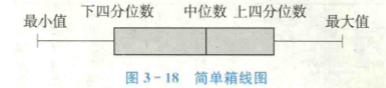

# 数据的预处理

数据的预处理是在对数据分类或分组之前所做的必要处理，包括数据的审核、筛选、排序等。

## 数据审核

数据审核就是检查数据中是否有错误。

对于调查取得的原始数据(raw data)，主要从完整性和准确性两个方面去审核。

完整性审核主要是检查应调查单位或个体是否存在遗漏，所有调查项目是否填写齐全。准确性审核主要是检查数据是否有错误，是否存在异常值等。对异常值要仔细鉴别，如果异常值是出于错误，则应当在分析前纠正；如果异常值是正确的，应予以保留。

对于二手数据，应着重审核数据的适用性和实效性。

## 数据筛选

数据筛选(data filter)是根据需要找出复合特定条件的某类数据。

## 数据排序

数据排序是指按照一定顺序将数据排列，以便研究者通过浏览数据发现一些明显特征或趋势，找到解决问题的线索。除此之外，有助于对数据进行检查纠错，以及为重新归类或分组等提供方便。

# 品质数据的整理与展示

## 分类数据的整理与图示

分类数据本身就是对事物的一种分类，因此，在整理时首先列出所分的类别，然后计算出每一类别的频数、频率、比例等，形成一张频数分布表。

### 频数与频数分布

频数(frequency)是落在某一特定类别或组中的数据个数。把各个类别及落在其中的相应频数全部列出，并用表格形式表现出来，称为频数分布(frequency distribution)。

对于定性数据，除了用频数分布表进行描述，还可以使用比例、百分比等进行描述。

### 分类数据的图示

#### 条形图

#### 帕累托图

#### 饼图

## 顺序数据的整理与图示

上述分类数据的频数分布表和图示方法也适用于顺序数据，但一些适用于顺序数据的整理和图示方法，并不适用于分类数据。

### 累积频数和累积频率

累积频数(cumulative frequencies)是将各有序类别或组的频数逐级累加起来得到的频数，分向上累积和向下累积两种方法。

累积频率或累积百分比(cumulative percentages)是将各有序类别或组的百分比逐级累加起来，也分向上累积和向下累积两种方法。

### 顺序数据的图示

根据累积频数或累积频率，可以绘制累积频数分布或频率图。

# 数值型数据的整理与展示

上述的分类数据和顺序数据的整理与图示方法也适用于数值型数据，但数值型数据还有一些特定的整理和图示方法，它们并不适用于分类数据和顺序数据。

## 数据分组

数据分组是根据统计研究的需要，将原始数据按照某种标准分成不同的组别，主要目的是观察数据的分布特征。

分组的方法有单变量分组和组距分组两种。单边量分组是把每个变量作为一组，通常只适合离散变量且在变量值较少的情况下适用。在连续变量或变量值较多的情况下，通常采用组距分组。

组距分组掩盖了各组内数据的分布状况，为反映各组数据的一般水平，我们通常用组中值作为该组数据的一个代表值。

$$组中值=\frac{上限值+下限值}{2}$$

适用组中值代表一组数据时有一个必要的假定条件，即各组数据在本组内呈均匀分布或在组中值两侧呈对称分布。

## 数值型数据的图示

数值型数据除了适用上述方法，还有以下一些图示方法，这些方法并不适用于分类数据或顺序数据。

### 分组数据：直方图

直方图与条形图不同。首先条形图适用条形的长度表示各类别频数的多少，其宽度是固定的；直方图是用面积表示各组频数的多少，矩形高度表示每一组的频数或频率，宽度则表示各组的组距。其次，直方图各矩形通常连续排列，而条形图则是分开排列。条形图主要用于展示分类数据，而直方图主要用于展示数值型数据。

### 未分组数据：箱线图

箱线图(box plot)是根据一组数据的最大值、最小值、中位数、两个四分位数者五个特征值绘制而成的，主要用于反映原始数据分布的特征及多组数据特征的比较。

### 时间序列数据：线图

线图主要用于反映现象随时间变化的特征。

### 多变量数据的图示

#### 散点图

散点图(scatter diagram)是用二维坐标展示两个变量间关系的一种图。

#### 气泡图

气泡图(bubble chart)可用于展示三个变量之间的关系。

#### 雷达图

